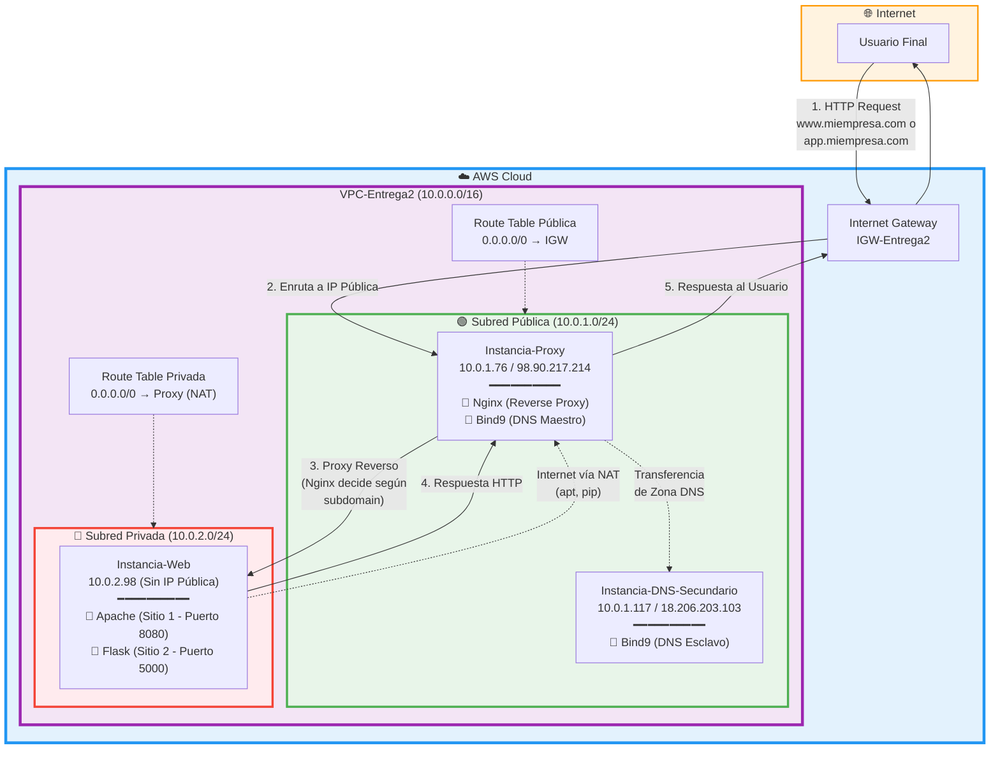

# Diagrama de Arquitectura - Proyecto AWS VPC

## Arquitectura Completa

## Tabla de Direccionamiento

| Componente | IP Privada | IP Pública | Subred | Función |
|------------|------------|------------|--------|---------|
| VPC-Entrega2 | 10.0.0.0/16 | - | - | Red Virtual Principal |
| Subred Pública | 10.0.1.0/24 | - | - | Hosts con acceso directo a Internet |
| Subred Privada | 10.0.2.0/24 | - | - | Hosts aislados (solo vía NAT) |
| Instancia-Proxy | 10.0.1.76 | 98.90.217.214 | Pública | Nginx + Bind9 (Maestro) + NAT |
| Instancia-DNS-Secundario | 10.0.1.117 | 18.206.203.103 | Pública | Bind9 (Esclavo) |
| Instancia-Web | 10.0.2.98 | - | Privada | Apache + Flask |
| Internet Gateway | - | - | - | Puerta de enlace a Internet |

## Flujo de Tráfico HTTP

1. **Cliente** envía petición HTTP a `www.miempresa.com` o `app.miempresa.com`.
2. **DNS** (Bind9 en Proxy o Secundario) resuelve el dominio a `98.90.217.214`.
3. **Internet Gateway** recibe la petición y la enruta al Proxy.
4. **Nginx** (Reverse Proxy) revisa el subdominio:
   - Si es `www` → redirige a `10.0.2.98:8080` (Apache - Sitio 1).
   - Si es `app` → redirige a `10.0.2.98:5000` (Flask - Sitio 2).
5. **Servidor Web** procesa la petición y devuelve la respuesta.
6. El **Proxy** reenvía la respuesta al cliente a través del IGW.

## Seguridad

### Security Group Público (SG-Publico)
- **Inbound:**
  - SSH (22) desde 0.0.0.0/0
  - HTTP (80) desde 0.0.0.0/0
  - DNS (53 UDP/TCP) desde 0.0.0.0/0
  - All Traffic desde 10.0.2.0/24 (para NAT)

### Security Group Privado (SG-Privado)
- **Inbound:**
  - SSH (22) desde 10.0.1.0/24
  - HTTP (8080) desde 10.0.1.0/24
  - Custom TCP (5000) desde 10.0.1.0/24

## Componentes de Software

### Instancia-Proxy (10.0.1.76)
- **Nginx:** Reverse Proxy en puerto 80
- **Bind9:** DNS Maestro para `miempresa.com`
- **NAT:** IP Forwarding + iptables MASQUERADE

### Instancia-DNS-Secundario (10.0.1.117)
- **Bind9:** DNS Esclavo (Replicación automática desde Maestro)

### Instancia-Web (10.0.2.98)
- **Apache:** Sirve Sitio 1 (Info) en puerto 8080
- **Flask:** Sirve Sitio 2 (CRUD) en puerto 5000
- **SQLite:** Base de datos para la aplicación CRUD

## Redundancia y Alta Disponibilidad

- **DNS Primario → Secundario:** Transferencia de zona automática para redundancia.
- **NAT via Proxy:** La instancia Web accede a Internet a través del Proxy (SPOF, pero suficiente para laboratorio).

---

> **Nota:** Este diagrama muestra la arquitectura completa implementada. Para la entrega, incluye también capturas de pantalla del AWS Resource Map como evidencia visual complementaria.
